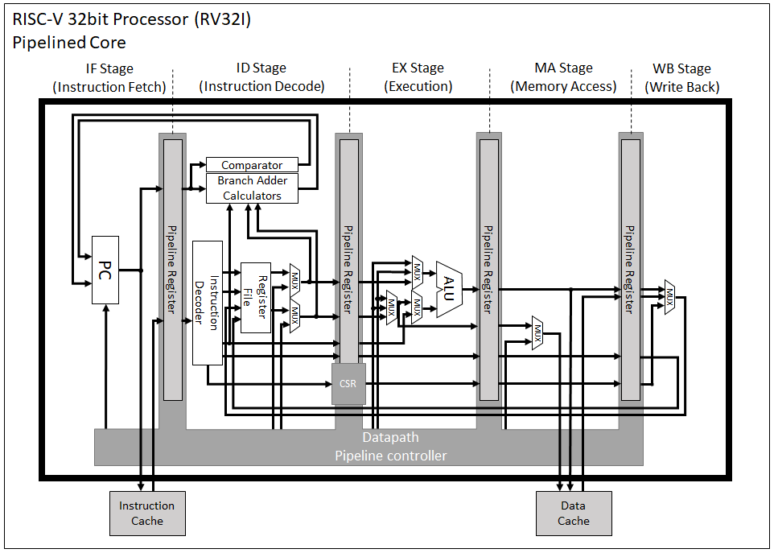

RISC-V Core written in Verilog
===============================

- ver.0.2

There are simple RISC-V cores (single cycle and pipeline).

### Block Diagram of RV32I Pipelined Core


License
========================================

Apache License (Version 2.0)  
http://www.apache.org/licenses/LICENSE-2.0  

Support ISA
========================================

#### RV32I
```
(Not yet supported) -> fence, fence.i, ecall, ebreak, uret, sret, mret, wfi, sfence.vma
```
#### RV32V
```
vl, vls, vs, vss, opivv (Vector mask is not yet supported)
```

Sample
========================================

If you want to simulation there cores, you must install Icarus-verilog and gtkwave.

Then you execute this command.


single core simulation
```
./gen.sh n

or

./gen.bat n
```

pipelined core simulation
```
./gen.sh p

or

./gen.bat p
```

Update history
========================================
2022/10/27: Development started in Youtube broadcast.  
2022/12/01: Implemented Single cycle RV32I core.  
2022/12/06: Implemented Pipelined RV32I core.  
2022/12/23: First commit version 0.1.  
2023/04/20: Implemented Vector Extension and commit.  
