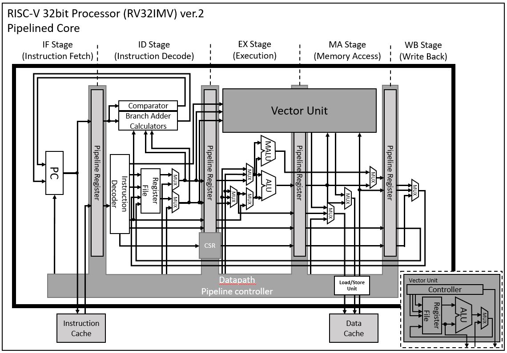

RISC-V Core written in Verilog
===============================

- ver.0.3

There are simple RISC-V cores (single cycle and pipeline).

### Block Diagram of RV32IMV Pipelined Core


License
========================================

Apache License (Version 2.0)  
http://www.apache.org/licenses/LICENSE-2.0  

Support ISA
========================================

#### RV32I
```
(Unimplemented) wfi, sfence.vma
```
#### RV32M
#### RV32V
```
vl, vls, vs, vss, opivv (Vector mask function not implemented)
```

Sample
========================================

If you want to simulation there cores, you must install Icarus-verilog and gtkwave.

Then you execute this command.


single core simulation
```
./gen.sh n

or

./gen.bat n
```

pipelined core simulation
```
./gen.sh p

or

./gen.bat p
```

Update history
========================================
2022/10/27: Development started in Youtube broadcast.  
2022/12/01: Implemented Single cycle RV32I core.  
2022/12/06: Implemented Pipelined RV32I core.  
2022/12/23: First commit version 0.1.  
2023/04/20: Implemented Vector Extension and commit.  
2023/04/22: Implemented Multiplication and Division Extension and commit.  
2023/06/01: Implemented Load/Store unit. And fixed testbench for data memory dumpable.  
2023/08/16: Implemented ecall ebreak mret for single cycle core.  
2023/08/17: Implemented ecall ebreak mret for pipelined core.  
2023/08/21: Implemented illegal instruction exception.  
2023/08/22: Added decodable function (fence, fence.i).  
2024/05/23: Implemented MALU multicycle mode.  
